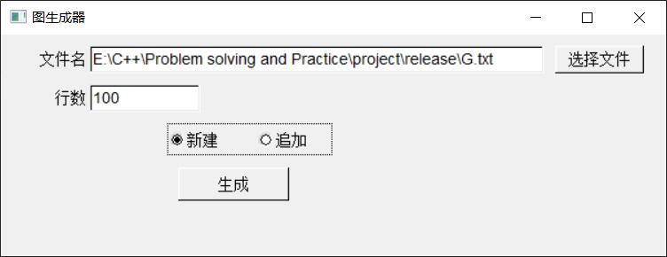

# 问题求解与实践 大作业

## 文件列表
```shell
│  GraphGenerator.cpp
│  GraphGenerator.h
│  GraphSplit.cpp
│  GraphSplit.h
│  Makefile
│  problem1.cpp
│  problem1_gui.cpp
│  problem2.cpp
│  problem3.cpp
│  problem4.cpp
│  README.md
│  std_lib_facilities.h
│  SubGraphMerge.cpp
│  SubGraphMerge.h
│  SubGraphProcess.cpp
│  SubGraphProcess.h
│
├─bin
│      p1.exe
│      p1_gui.exe
│      p2.exe
│      p3.exe
│      p4.exe
│
└─pic
        p1_gui1.jpg
        p1_gui2.jpg
```

## 编译
```shell
#编译所有文件（不含gui）
make all

#编译所有文件（含gui）
#可能需要修改Makefile以指定fltk目录
make all_gui

#清空临时文件
make clean
```
+ 除problem1_gui.cpp编码为UTF-8外，其余文件编码均为GBK

## 运行

### 图生成器
` p1 create|append lines PATH [MaxNodeID MaxWeight]`
+ cretate 表示创建新文件，append表示追加（若文件不存在则新建）
+ lines 指定文件行数
+ PATH 指定输出文件目录
+ MaxNodeID 随机生成的最大节点编号 *（可选）*（默认为200）
+ MaxWeight 随机生成的最大边权重 *（可选）*（默认为200）

### 图生成器（GUI）
+ 运行截图

  

  

> GUI部分代码参考自fltk源代码包中示例

### 图切割器
`p2 GraphFilePath SubGraphMaxNodeNum`
+ GraphFilePath 指定原图文件目录
+ SubGraphMaxNodeNum 指定每个子图所含最多节点数
+ 可以不使用命令行参数，启动程序后会请求用户输入
+ 子图文件输出目录为"./data/"
+ 时间性能参考：
  + 200节点，2000边，子图节点数限制50，~75ms
  + 200节点，2000边，子图节点数限制100，~100ms
  + 200节点，10000边，子图节点数限制100，~150ms
  + 1000节点，10000边，子图节点数限制100，~600ms
  + 2000节点，10000边，子图节点数限制100，~900ms
  + 2000节点，10000边，子图节点数限制1000，~2s

### 图合并器
+ 默认读取目录为"./data/" 

### 子图上的算法
+ 直接运行文件后会提示用户输入操作
+ 操作1：输入一个节点，输出所有可以到达的节点
+ 操作2：输入两个节点，输出节点间最短路径及其长度