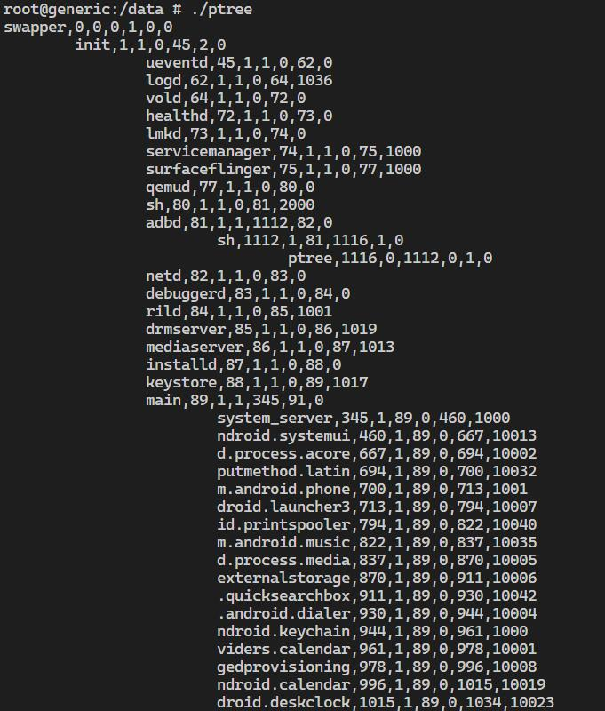
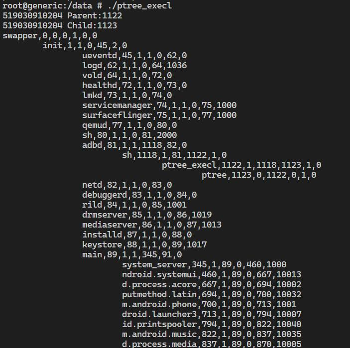

# Output Examples

## Problem 1
    This module has no output.
## Problem 2

+ If error occurs during syscall.
```
root@generic:/data # ./ptree        
Error occurs during syscall: -1
```

+ Normal situation.
```
root@generic:/data # ./ptree
swapper,0,0,0,1,0,0
        init,1,1,0,45,2,0
                ueventd,45,1,1,0,61,0
                logd,61,1,1,0,67,1036
                vold,67,1,1,0,77,0
                healthd,77,1,1,0,78,0
                lmkd,78,1,1,0,79,0
                servicemanager,79,1,1,0,80,1000
                surfaceflinger,80,1,1,0,82,1000
                qemud,82,1,1,0,85,0
                sh,85,1,1,0,86,2000
                adbd,86,1,1,1084,87,0
                        sh,1084,1,86,1089,1,0
                                ptree,1089,0,1084,0,1,0
                netd,87,1,1,0,88,0
                debuggerd,88,1,1,0,89,0
                rild,89,1,1,0,90,1001
                drmserver,90,1,1,0,91,1019
                mediaserver,91,1,1,0,92,1013
                installd,92,1,1,0,93,0
                keystore,93,1,1,0,94,1017
                main,94,1,1,247,95,0
                        system_server,247,1,94,0,455,1000
                        ndroid.systemui,455,1,94,0,483,10013
                        externalstorage,483,1,94,0,657,10006
                        putmethod.latin,657,1,94,0,672,10032
                        d.process.media,672,1,94,0,677,10005
                        m.android.phone,677,1,94,0,688,1001
                        droid.launcher3,688,1,94,0,720,10007
                        d.process.acore,720,1,94,0,761,10002
                        id.printspooler,761,1,94,0,768,10040
                        m.android.music,768,1,94,0,838,10035
                        droid.deskclock,838,1,94,0,902,10023
                        .quicksearchbox,902,1,94,0,917,10042
                        ndroid.settings,917,1,94,0,931,1000
                        ndroid.calendar,931,1,94,0,950,10019
                        viders.calendar,950,1,94,0,973,10001
                        .android.dialer,973,1,94,0,989,10004
                        ndroid.keychain,989,1,94,0,1009,1000
                        gedprovisioning,1009,1,94,0,1033,10008
                        m.android.email,1033,1,94,0,1048,10027
                        ndroid.exchange,1048,1,94,0,1,10029
                gatekeeperd,95,1,1,0,96,1000
                perfprofd,96,1,1,0,97,0
                fingerprintd,97,1,1,0,1,1000
        kthreadd,2,1,0,3,0,0
                ksoftirqd/0,3,1,2,0,4,0
                kworker/0:0,4,1,2,0,6,0
                khelper,6,1,2,0,7,0
                sync_supers,7,1,2,0,8,0
                bdi-default,8,1,2,0,9,0
                kblockd,9,1,2,0,10,0
                rpciod,10,1,2,0,12,0
                kswapd0,12,1,2,0,13,0
                fsnotify_mark,13,1,2,0,14,0
                crypto,14,1,2,0,25,0
                kworker/u:1,25,1,2,0,30,0
                mtdblock0,30,1,2,0,35,0
                mtdblock1,35,1,2,0,40,0
                mtdblock2,40,1,2,0,41,0
                binder,41,1,2,0,42,0
                deferwq,42,1,2,0,43,0
                kworker/u:2,43,1,2,0,44,0
                mmcqd/0,44,1,2,0,47,0
                jbd2/mtdblock0-,47,1,2,0,48,0
                ext4-dio-unwrit,48,1,2,0,51,0
                flush-31:1,51,1,2,0,53,0
                jbd2/mtdblock1-,53,1,2,0,54,0
                ext4-dio-unwrit,54,1,2,0,57,0
                flush-31:2,57,1,2,0,59,0
                jbd2/mtdblock2-,59,1,2,0,60,0
                ext4-dio-unwrit,60,1,2,0,66,0
                kauditd,66,1,2,0,117,0
                kworker/0:2,117,1,2,0,823,0
                flush-179:0,823,1,2,0,0,0
```

+ Screenshot of normal situation (incomplete).



## Problem 3

+ If file `ptree` does not exsist.
```
root@generic:/data # ./ptree_execl                                             
51903091xxxx Parent:1103
51903091xxxx Child:1104
Error occurs while execl ptree: 2
Parent process exit.
```

+ If error occurs during syscall.
```
root@generic:/data # ./ptree_execl                                             
51903091xxxx Parent:1189
51903091xxxx Child:1190
Error occurs during syscall: -1
Parent process exit.
```

+ Normal situation.
```
root@generic:/data # ./ptree_execl  
51903091xxxx Parent:1090
51903091xxxx Child:1091
swapper,0,0,0,1,0,0
        init,1,1,0,45,2,0
                ueventd,45,1,1,0,61,0
                logd,61,1,1,0,67,1036
                vold,67,1,1,0,77,0
                healthd,77,1,1,0,78,0
                lmkd,78,1,1,0,79,0
                servicemanager,79,1,1,0,80,1000
                surfaceflinger,80,1,1,0,82,1000
                qemud,82,1,1,0,85,0
                sh,85,1,1,0,86,2000
                adbd,86,1,1,1084,87,0
                        sh,1084,1,86,1090,1,0
                                ptree_execl,1090,1,1084,1091,1,0
                                        ptree,1091,0,1090,0,1,0
                netd,87,1,1,0,88,0
                debuggerd,88,1,1,0,89,0
                rild,89,1,1,0,90,1001
                drmserver,90,1,1,0,91,1019
                mediaserver,91,1,1,0,92,1013
                installd,92,1,1,0,93,0
                keystore,93,1,1,0,94,1017
                main,94,1,1,247,95,0
                        system_server,247,1,94,0,455,1000
                        ndroid.systemui,455,1,94,0,483,10013
                        externalstorage,483,1,94,0,657,10006
                        putmethod.latin,657,1,94,0,672,10032
                        d.process.media,672,1,94,0,677,10005
                        m.android.phone,677,1,94,0,688,1001
                        droid.launcher3,688,1,94,0,720,10007
                        d.process.acore,720,1,94,0,761,10002
                        id.printspooler,761,1,94,0,768,10040
                        m.android.music,768,1,94,0,838,10035
                        droid.deskclock,838,1,94,0,902,10023
                        .quicksearchbox,902,1,94,0,917,10042
                        ndroid.settings,917,1,94,0,931,1000
                        ndroid.calendar,931,1,94,0,950,10019
                        viders.calendar,950,1,94,0,973,10001
                        .android.dialer,973,1,94,0,989,10004
                        ndroid.keychain,989,1,94,0,1009,1000
                        gedprovisioning,1009,1,94,0,1033,10008
                        m.android.email,1033,1,94,0,1048,10027
                        ndroid.exchange,1048,1,94,0,1,10029
                gatekeeperd,95,1,1,0,96,1000
                perfprofd,96,1,1,0,97,0
                fingerprintd,97,1,1,0,1,1000
        kthreadd,2,1,0,3,0,0
                ksoftirqd/0,3,1,2,0,4,0
                kworker/0:0,4,1,2,0,6,0
                khelper,6,1,2,0,7,0
                sync_supers,7,1,2,0,8,0
                bdi-default,8,1,2,0,9,0
                kblockd,9,1,2,0,10,0
                rpciod,10,1,2,0,12,0
                kswapd0,12,1,2,0,13,0
                fsnotify_mark,13,1,2,0,14,0
                crypto,14,1,2,0,25,0
                kworker/u:1,25,1,2,0,30,0
                mtdblock0,30,1,2,0,35,0
                mtdblock1,35,1,2,0,40,0
                mtdblock2,40,1,2,0,41,0
                binder,41,1,2,0,42,0
                deferwq,42,1,2,0,43,0
                kworker/u:2,43,1,2,0,44,0
                mmcqd/0,44,1,2,0,47,0
                jbd2/mtdblock0-,47,1,2,0,48,0
                ext4-dio-unwrit,48,1,2,0,51,0
                flush-31:1,51,1,2,0,53,0
                jbd2/mtdblock1-,53,1,2,0,54,0
                ext4-dio-unwrit,54,1,2,0,57,0
                flush-31:2,57,1,2,0,59,0
                jbd2/mtdblock2-,59,1,2,0,60,0
                ext4-dio-unwrit,60,1,2,0,66,0
                kauditd,66,1,2,0,117,0
                kworker/0:2,117,1,2,0,823,0
                flush-179:0,823,1,2,0,0,0
Parent process exit.
```

+ Screenshot of normal situation (incomplete).



## Problem 4

+ Situations without enough params or with too many params.
```
root@generic:/data # ./BBC
Usage: BBC Cooks Cashiers Customers RackSize
```

```
root@generic:/data # ./BBC 123 12  
Usage: BBC Cooks Cashiers Customers RackSize
```

```
root@generic:/data # ./BBC 123 12 2 3 4 5 6
Usage: BBC Cooks Cashiers Customers RackSize
```

+ Situations with illegal params.
```
root@generic:/data # ./BBC 123 12 aaa 45 
Params error!
Usage: BBC Cooks Cashiers Customers RackSize
```

```
root@generic:/data # ./BBC -1 1 1 1   
Params error!
Usage: BBC Cooks Cashiers Customers RackSize
```

+ Normal situations.
```
root@generic:/data # ./BBC 1 1 1 1  
Cooks[1],Cashiers[1],Customers[1]
Begin run.
Cook[0] makes a burger.
Customer[0] comes.
Cashier[0] accepts an order.
Cashier[0] takes a burger to customer.
Process end.
```

```
root@generic:/data # ./BBC 2 4 41 10                                           
Cooks[2],Cashiers[4],Customers[41]
Begin run.
Customer[19] comes.
Cashier[3] accepts an order.
Customer[34] comes.
Customer[4] comes.
Cashier[2] accepts an order.
Cashier[1] accepts an order.
Cook[1] makes a burger.
Cashier[3] takes a burger to customer.
Cook[1] makes a burger.
Cashier[2] takes a burger to customer.
Customer[39] comes.
Cashier[0] accepts an order.
Customer[17] comes.
Cashier[3] accepts an order.
Cook[0] makes a burger.
Cashier[1] takes a burger to customer.
Customer[16] comes.
Cashier[2] accepts an order.
Customer[29] comes.
Cashier[1] accepts an order.
Cook[1] makes a burger.
Cashier[0] takes a burger to customer.
Customer[32] comes.
Cashier[0] accepts an order.
Customer[13] comes.
Customer[10] comes.
Customer[2] comes.
Customer[35] comes.
Customer[37] comes.
Customer[14] comes.
Cook[0] makes a burger.
Cashier[3] takes a burger to customer.
Cashier[3] accepts an order.
Cook[1] makes a burger.
Cashier[3] takes a burger to customer.
Cashier[3] accepts an order.
Customer[21] comes.
Cook[0] makes a burger.
Cashier[3] takes a burger to customer.
Cashier[3] accepts an order.
Customer[25] comes.
Cook[1] makes a burger.
Cashier[3] takes a burger to customer.
Cashier[3] accepts an order.
Customer[33] comes.
Cook[0] makes a burger.
Cashier[3] takes a burger to customer.
Cashier[3] accepts an order.
Cook[0] makes a burger.
Cashier[3] takes a burger to customer.
Cashier[3] accepts an order.
Cook[1] makes a burger.
Cashier[3] takes a burger to customer.
Cashier[3] accepts an order.
Cook[0] makes a burger.
Cashier[3] takes a burger to customer.
Cashier[3] accepts an order.
Customer[8] comes.
Cook[0] makes a burger.
Cashier[3] takes a burger to customer.
Cashier[3] accepts an order.
Cook[1] makes a burger.
Cashier[3] takes a burger to customer.
Cashier[3] accepts an order.
Customer[24] comes.
Cook[1] makes a burger.
Cashier[3] takes a burger to customer.
Cashier[3] accepts an order.
Cook[0] makes a burger.
Cashier[3] takes a burger to customer.
Customer[15] comes.
Cashier[3] accepts an order.
Cook[1] makes a burger.
Cashier[2] takes a burger to customer.
Customer[27] comes.
Cashier[2] accepts an order.
Customer[22] comes.
Cook[0] makes a burger.
Cashier[1] takes a burger to customer.
Cashier[1] accepts an order.
Cook[0] makes a burger.
Cashier[0] takes a burger to customer.
Customer[26] comes.
Customer[38] comes.
Cashier[0] accepts an order.
Customer[36] comes.
Cook[1] makes a burger.
Cashier[3] takes a burger to customer.
Cashier[3] accepts an order.
Customer[12] comes.
Customer[18] comes.
Customer[3] comes.
Cook[1] makes a burger.
Cashier[3] takes a burger to customer.
Cashier[3] accepts an order.
Cook[0] makes a burger.
Cashier[3] takes a burger to customer.
Cashier[3] accepts an order.
Cook[0] makes a burger.
Cashier[3] takes a burger to customer.
Cashier[3] accepts an order.
Cook[1] makes a burger.
Cashier[3] takes a burger to customer.
Cashier[3] accepts an order.
Cook[1] makes a burger.
Cashier[3] takes a burger to customer.
Cook[0] makes a burger.
Cashier[2] takes a burger to customer.
Cook[1] makes a burger.
Cashier[1] takes a burger to customer.
Cook[0] makes a burger.
Cashier[0] takes a burger to customer.
Customer[11] comes.
Cashier[3] accepts an order.
Customer[40] comes.
Cashier[2] accepts an order.
Customer[1] comes.
Cashier[1] accepts an order.
Customer[6] comes.
Cashier[0] accepts an order.
Cook[0] makes a burger.
Cashier[3] takes a burger to customer.
Customer[23] comes.
Cashier[3] accepts an order.
Customer[5] comes.
Cook[1] makes a burger.
Cashier[2] takes a burger to customer.
Cashier[2] accepts an order.
Cook[0] makes a burger.
Cashier[2] takes a burger to customer.
Cook[0] makes a burger.
Cashier[1] takes a burger to customer.
Customer[28] comes.
Cashier[2] accepts an order.
Customer[31] comes.
Customer[9] comes.
Cashier[1] accepts an order.
Customer[7] comes.
Cook[0] makes a burger.
Cashier[0] takes a burger to customer.
Cashier[0] accepts an order.
Cook[0] makes a burger.
Cashier[0] takes a burger to customer.
Cashier[0] accepts an order.
Cook[1] makes a burger.
Cashier[0] takes a burger to customer.
Customer[20] comes.
Cashier[0] accepts an order.
Cook[1] makes a burger.
Cashier[3] takes a burger to customer.
Cook[1] makes a burger.
Cashier[2] takes a burger to customer.
Cook[0] makes a burger.
Cashier[1] takes a burger to customer.
Cook[0] makes a burger.
Cashier[0] takes a burger to customer.
Cook[0] makes a burger.
Customer[30] comes.
Cashier[3] accepts an order.
Cashier[3] takes a burger to customer.
Customer[0] comes.
Cashier[3] accepts an order.
Cook[1] makes a burger.
Cashier[3] takes a burger to customer.
Process end.
```

```
root@generic:/data # ./BBC 1 2 20 4 
Cooks[1],Cashiers[2],Customers[20]
Begin run.
Customer[10] comes.
Cashier[1] accepts an order.
Cook[0] makes a burger.
Cashier[1] takes a burger to customer.
Customer[12] comes.
Cashier[0] accepts an order.
Cook[0] makes a burger.
Cashier[0] takes a burger to customer.
Customer[9] comes.
Cashier[1] accepts an order.
Customer[8] comes.
Cashier[0] accepts an order.
Customer[3] comes.
Cook[0] makes a burger.
Cashier[1] takes a burger to customer.
Cashier[1] accepts an order.
Cook[0] makes a burger.
Cashier[1] takes a burger to customer.
Cook[0] makes a burger.
Cashier[0] takes a burger to customer.
Customer[5] comes.
Cashier[1] accepts an order.
Cook[0] makes a burger.
Cashier[1] takes a burger to customer.
Customer[17] comes.
Cashier[0] accepts an order.
Cook[0] makes a burger.
Cashier[0] takes a burger to customer.
Customer[6] comes.
Cashier[1] accepts an order.
Customer[2] comes.
Cashier[0] accepts an order.
Customer[14] comes.
Customer[16] comes.
Cook[0] makes a burger.
Cashier[1] takes a burger to customer.
Cashier[1] accepts an order.
Cook[0] makes a burger.
Cashier[1] takes a burger to customer.
Cashier[1] accepts an order.
Customer[13] comes.
Cook[0] makes a burger.
Cashier[1] takes a burger to customer.
Cashier[1] accepts an order.
Cook[0] makes a burger.
Cashier[1] takes a burger to customer.
Customer[1] comes.
Cashier[1] accepts an order.
Customer[0] comes.
Cook[0] makes a burger.
Cashier[0] takes a burger to customer.
Cashier[0] accepts an order.
Cook[0] makes a burger.
Cashier[0] takes a burger to customer.
Customer[18] comes.
Cashier[0] accepts an order.
Cook[0] makes a burger.
Cashier[1] takes a burger to customer.
Cook[0] makes a burger.
Cashier[0] takes a burger to customer.
Customer[19] comes.
Cashier[1] accepts an order.
Customer[11] comes.
Cashier[0] accepts an order.
Cook[0] makes a burger.
Cashier[1] takes a burger to customer.
Customer[7] comes.
Cashier[1] accepts an order.
Customer[4] comes.
Customer[15] comes.
Cook[0] makes a burger.
Cashier[0] takes a burger to customer.
Cashier[0] accepts an order.
Cook[0] makes a burger.
Cashier[0] takes a burger to customer.
Cashier[0] accepts an order.
Cook[0] makes a burger.
Cashier[0] takes a burger to customer.
Cook[0] makes a burger.
Cashier[1] takes a burger to customer.
Process end.
```

```
root@generic:/data # ./BBC 3 2 20 4
Cooks[3],Cashiers[2],Customers[20]
Begin run.
Customer[9] comes.
Cashier[1] accepts an order.
Cook[0] makes a burger.
Cashier[1] takes a burger to customer.
Cook[0] makes a burger.
Cook[1] makes a burger.
Cook[2] makes a burger.
Cook[0] makes a burger.
Customer[1] comes.
Cashier[0] accepts an order.
Cashier[0] takes a burger to customer.
Cook[0] makes a burger.
Customer[19] comes.
Customer[18] comes.
Cashier[0] accepts an order.
Cashier[0] takes a burger to customer.
Cashier[0] accepts an order.
Cashier[0] takes a burger to customer.
Cook[1] makes a burger.
Cook[0] makes a burger.
Customer[17] comes.
Cashier[0] accepts an order.
Cashier[0] takes a burger to customer.
Cook[2] makes a burger.
Customer[4] comes.
Cashier[0] accepts an order.
Cashier[0] takes a burger to customer.
Cook[0] makes a burger.
Customer[14] comes.
Cashier[0] accepts an order.
Cashier[0] takes a burger to customer.
Cook[2] makes a burger.
Customer[16] comes.
Cashier[0] accepts an order.
Cashier[0] takes a burger to customer.
Customer[5] comes.
Cook[1] makes a burger.
Cashier[0] accepts an order.
Cashier[0] takes a burger to customer.
Cook[0] makes a burger.
Customer[6] comes.
Cashier[0] accepts an order.
Cashier[0] takes a burger to customer.
Cook[1] makes a burger.
Customer[2] comes.
Cashier[0] accepts an order.
Cashier[0] takes a burger to customer.
Cook[0] makes a burger.
Customer[8] comes.
Cashier[0] accepts an order.
Cashier[0] takes a burger to customer.
Customer[11] comes.
Cook[2] makes a burger.
Cashier[0] accepts an order.
Cashier[0] takes a burger to customer.
Cook[1] makes a burger.
Customer[3] comes.
Cashier[0] accepts an order.
Cashier[0] takes a burger to customer.
Cook[0] makes a burger.
Customer[7] comes.
Cashier[0] accepts an order.
Cashier[0] takes a burger to customer.
Cook[0] makes a burger.
Customer[10] comes.
Cashier[0] accepts an order.
Cashier[0] takes a burger to customer.
Cook[1] makes a burger.
Customer[15] comes.
Cashier[0] accepts an order.
Cashier[0] takes a burger to customer.
Cook[2] makes a burger.
Customer[12] comes.
Cashier[0] accepts an order.
Cashier[0] takes a burger to customer.
Cook[0] makes a burger.
Customer[0] comes.
Cashier[1] accepts an order.
Cashier[1] takes a burger to customer.
Cook[2] makes a burger.
Customer[13] comes.
Cashier[1] accepts an order.
Cashier[1] takes a burger to customer.
Process end.
```

```
root@generic:/data # ./BBC 2 1 10 2 
Cooks[2],Cashiers[1],Customers[10]
Begin run.
Customer[2] comes.
Cashier[0] accepts an order.
Cook[0] makes a burger.
Cashier[0] takes a burger to customer.
Cook[1] makes a burger.
Cook[0] makes a burger.
Customer[1] comes.
Cashier[0] accepts an order.
Cashier[0] takes a burger to customer.
Cook[0] makes a burger.
Customer[5] comes.
Customer[4] comes.
Cashier[0] accepts an order.
Cashier[0] takes a burger to customer.
Cook[0] makes a burger.
Customer[0] comes.
Cashier[0] accepts an order.
Cashier[0] takes a burger to customer.
Cook[1] makes a burger.
Cashier[0] accepts an order.
Cashier[0] takes a burger to customer.
Cook[0] makes a burger.
Customer[9] comes.
Cashier[0] accepts an order.
Cashier[0] takes a burger to customer.
Cook[1] makes a burger.
Customer[7] comes.
Cashier[0] accepts an order.
Cashier[0] takes a burger to customer.
Cook[0] makes a burger.
Customer[6] comes.
Cashier[0] accepts an order.
Cashier[0] takes a burger to customer.
Cook[1] makes a burger.
Customer[3] comes.
Cashier[0] accepts an order.
Cashier[0] takes a burger to customer.
Cook[0] makes a burger.
Customer[8] comes.
Cashier[0] accepts an order.
Cashier[0] takes a burger to customer.
Process end.
```