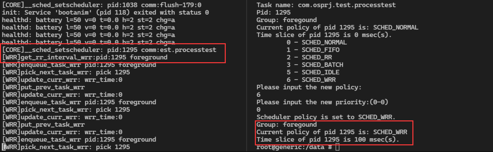
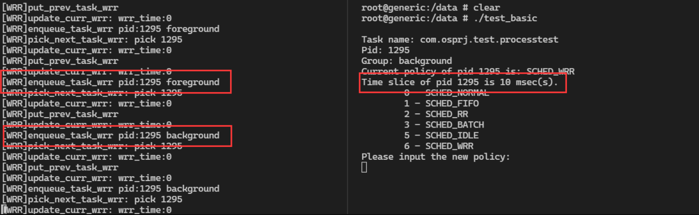
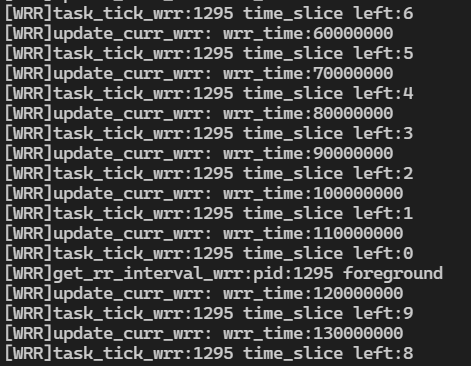
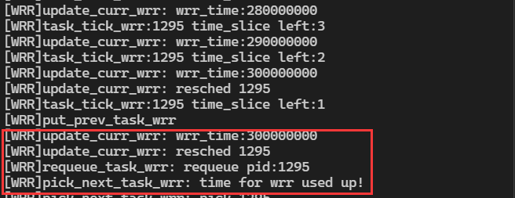
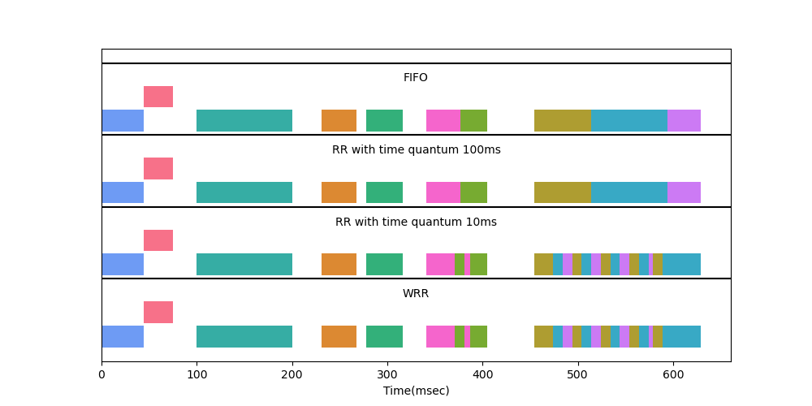
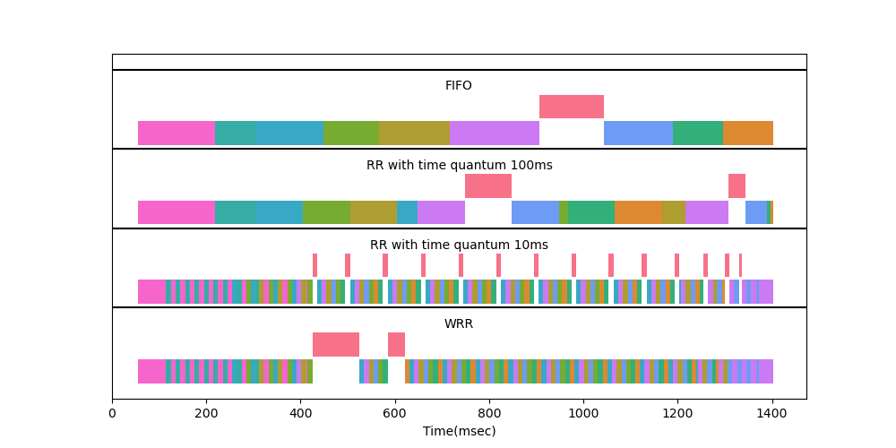
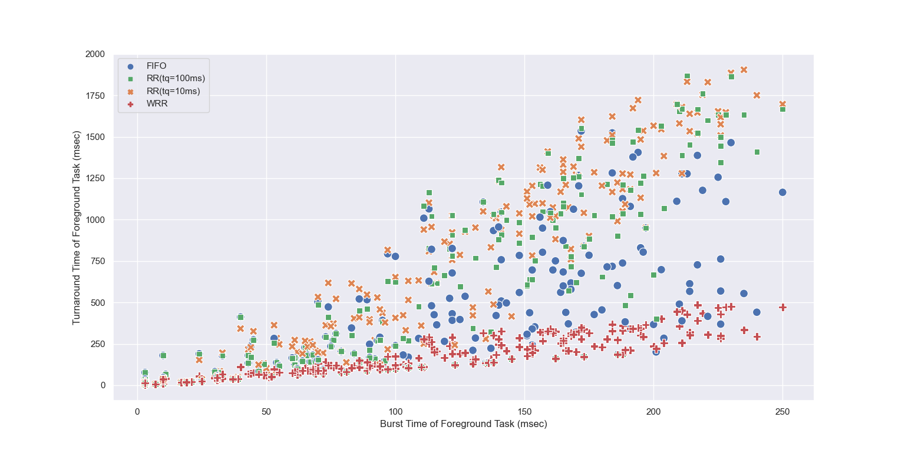
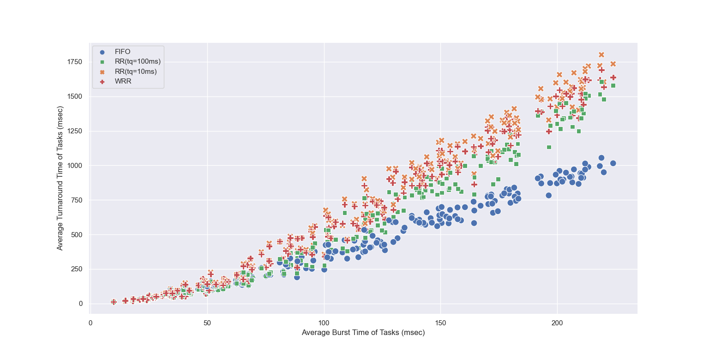
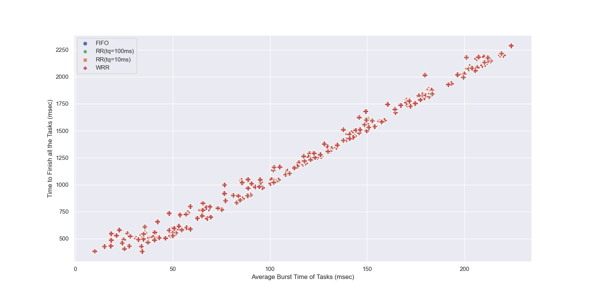

# OS Project2 Report

## Problem Analysis

The function `__schedule()` is the main body of the core scheduler.

The `__schedule` function interacts with the scheduling classes to complete the main scheduling work. Inside the `__schedule` function, `put_prev_task` function of the current scheduling class is called first, and `task_struct` of the currently running task is put into the ready queue of the scheduling class to which the task belongs. Then, `pick_next_task` function is called to pick the next task from the scheduling class and perform context switching.

For a system with multiple scheduling classes, the kernel will start from the class with the highest priority and call the `put_prev_task` function of that class. If `put_prev_task` function returns a `NULL` pointer, the kernel will call the `put_prev_task` function of the next scheduling class according to the `next` member specified in the scheduling class and repeat the above operation. In particular, the `next` member of the lowest priority scheduling class points to the highest priority scheduling class, and thus the scheduling classes form a circular queue.

In order to implement a custom scheduling class, we need to implement the following functions:
* `enqueue_task`: Put a task into the ready queue.
* `dequeue_task`: Remove the first task from the ready queue.
* `yield_task`: Put the task at the head of the queue to the tail.
* `check_preempt_curr`: Check whether the current task will be preempted.
* `pick_next_task`: Return the next task to be executed, if a `NULL` pointer is returned, the control will be passed to the next scheduling class.
* `put_prev_task`: Put the previous task back into the ready queue if needed.
* `set_curr_task`: Configure the currently running task.
* `task_tick`: Triggered by the kernel regularly, used to update the state during execution.
* `get_rr_interval`: Return the length of the next time slice of the task.

##  Implementation

The major part of WRR is in `kernel/sched/wrr.c`, we mainly implement these following functions:

+ `enqueue_task_wrr`: Add a task to ready queue of WRR.
+ `dequeue_task_wrr`: Remove a task from ready queue of WRR.
+ `requeue_task_wrr`: Put task to the head or the tail of the ready queue without the overhead of dequeue followed by enqueue.
+ `yield_task_wrr`: Move task to the tail of ready queue.
+ `pick_next_task_wrr`: Select the next task to run. If there is no ready task or the current round of WRR has reached the time limit, it returns a `NULL` pointer.
+ `put_prev_task_wrr`: Put the previous task back to the tail of ready queue if needed.
+ `set_curr_task_wrr`: Record the time when the task execution started.
+ `task_tick_wrr`: This function is invoked every 1ms and will update the remaining time slice of the task. When it finds that the task time slice is exhausted, it will recalculate the time slice and mark the task as needing rescheduling.
+ `get_rr_interval_wrr`: Calculate the time slice and weight by the group to which the task belongs.

For other files, we have these following implementations:

+ `goldfish_armv7_defconfig`
    + add `CONFIG_WRR_GROUP_SCHED` option and set it to `y`.
    + set `CONFIG_MODULES`,`CONFIG_MODULE_FORCE_UNLOAD`,`CONFIG_DEBUG_INFO`and some other options to `y` so that we do not need to manually modify GUI config every time.
+ `init/Kconfig`
    + add configuration option `WRR_GROUP_SCHED`, so that the option in `goldfish_armv7_defconfig` take effect. Moreover, we can find this option in GUI config after this change.
+ `include/linux/sched.h`
    + define `SCHED_WRR` with value 6 to indicate WRR policy.
    + define `WRR_BACK_TIMESLICE` and `WRR_FORE_TIMESLICE` with const value 10ms and 100ms respectively.
    + define `sched_wrr_entity` structure to store necessary information for each WRR task which includes:
        + `run_list`: a `link_head` instance to link neighbor tasks.
        + `time_slices` : indicate the time for every RR turn.
        + `weight`: indicate the weight of a task. `weight` of a foreground process is `10` and that of a foreground process is `1` .
+ `include/linux/init_task.h`
    + add `wrr` member in `INIT_TASK` for initialization.
+ `kernel/sched/core.c`
    + define `sysctl_sched_wrr_runtime` which indicate the total time limit for each round of WRR.
    + revise system calls `sched_get_priority_max` and `sched_get_priority_min`, set the upper and lower limits of WRR priority.
    + revise function `__sched_fork`, initialize `wrr.run_list` for a newly forked process.
    + revise function `rt_mutex_setprio`,`__setscheduler` so that the schedule policy can be set properly.
    + revise function `__sched_setscheduler`, add `WRR_SCHED` to valid policy list.
    + revise function `sched_init`, invoke function `init_wrr_rq` to initialize ready queue of WRR.
+ `kernel/sched/debug.c`
    + remove `static` keyword of function `task_group_path`, so it can be invoked by other source files now.
+ `kernel/sched/rt.c`
    + modify `.next` in `rt_sched_class` to make it point to `wrr_sched_class`.
+ `kernel/sched/sched.h`
    + define structure `wrr_rq`, which is the ready queue of WRR.
    + add member `wrr` of type `wrr_rq` to structure `rq`.
    + add function `global_wrr_runtime` which calculates the time limit for WRR.
    + declare some external functions which will be implemented in other source files.
+ `kernel/sched/Makefile`
    + add `wrr.o` for compilation.

## Testing

In order to test the WRR scheduler we implemented, I wrote the following test programs:
* `set_sched`: This program can modify the scheduling policy and priority of the specified process.
* `get_interval`: This program can output the time slice allocated to the specified process.
* `test_basic`: This program can automatically search for the `PID` of the test app and output scheduling information such as scheduling policy and time slice. It can also change the scheduling policy of the test app conveniently and output the results after the modifying.

In addition, in order to check whether the WRR scheduler is working properly, I added some `printk` to the kernel scheduler to output debugging information.

## Test Result

Start the simulator and open the test APP. Keep the test APP in the foreground.

Use adb to execute `test_basic` to switch the scheduling policy of the test APP to WRR. The output of the system kernel and `test_basic`  is shown in the screenshot below:

It can be seen from kernel output that the scheduling policy of the test APP has been switched to WRR. The WRR scheduler correctly outputs the current state of the test APP (foreground). According to the output of `test_basic`, the time slice length of the test APP is 100 milliseconds.

Switch the test APP to the background, and it can be seen from the kernel output that WRR has recognized the state change. Execute `test_basic` again, the time slice of the test APP has been set to 10 milliseconds.

Switch the test APP back to the foreground and click the START button.

The program starts to run, and WRR starts to calculate the remaining time slice of the test APP. When the time slice is exhausted, WRR recalculates the time slice length. Here, because the test APP is the only task in the WRR ready queue and the current round of WRR time has not reached the limit, due to performance considerations, WRR does not perform task switching.

When the running time of this round of WRR reaches the set upper limit, WRR will mark the current task as needing to be rescheduled, and the `pick_next_task_wrr` function will return a `NULL` pointer to transfer control to the next scheduling class.

## Additional Work

I originally planned to perform performance testing of multiple scheduling policies in AVD, but I found that due to the performance bottleneck of virtual device, the operating system's own services and user interactions will cause a lot of additional overhead. In addition, AVD is often in a slow response state under high load, and it is difficult to switch the test APP to the background in time. Therefore, I decided to write a script to simulate the task scheduling of the system under different scheduling classes.

The simulation script will randomly generate a task list. The start time of each task is evenly distributed from 0 to 500 milliseconds, and the burst time of tasks obeys a normal distribution. The script will use four scheduling strategies to simulate scheduling the same task list. The four scheduling strategies tested are FIFO, RR with time quantum 100ms, RR with time quantum 10ms, and WRR. CFS is not included in the comparison due to its greater impact on task priority.

*The upper band of each group of Gantt charts represents foreground tasks, and the rest represent background tasks.*

As can be seen from the above figure, when the system load is low, the four scheduling policies have little difference. But when the system load increases, the situation changes.

In the case of heavy system load, the response time and turnaround time of foreground tasks under WRR scheduling are much faster than other scheduling methods.

In order to get a more general conclusion, I keep changing the average burst time of the tasks and repeat the simulation. Visualize the simulation results and get the following scatter plots.

This scatter plot shows the relationship between turnaround time of foreground task and burst time of foreground task, which further illustrates the correctness of our previous conclusions.

This scatter plot shows the relationship between average turnaround time and average burst time for all tasks. The average burst time under WRR scheduling is similar to the two RR scheduling policies, but slightly worse than FIFO.

This picture shows that the four scheduling policies take exactly the same time to complete all tasks. That is, if we ignore the context switching overhead, the overall system performance will not be affected by the scheduling policy.

Based on our simulation results, we can draw the following conclusions:
* For systems that focus on user interaction (such as Android), WRR scheduling can effectively improve the system's response speed to user interaction.
* For systems where single task is relatively simple but requires an overall timely response (such as the operating system of a network server), FIFO scheduling can better complete a series of requests.

## Acknowledgements

I would like to express my gratitude to all those who helped me during this project. 
* Thanks to Prof. Wu and Prof. Chen who teach us basic concepts of operating system and provide us with these two interesting curriculum design projects. 
* Thanks to all TAs for early explanations and detailed instructions.
* Thanks to elixir.bootlin.com, a website that provides a detailed search of the Liunx kernel source code.
* Thanks to man7.org, a website that provides an online Linux manual page.
* Thanks to Jinkyu Koo for writing a blog that elaborated on the task scheduling strategy of the Linux kernel.
* Thanks to google search for providing high-quality information retrieval services.

