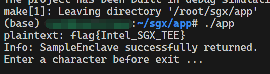

# SGX开发实验

本次实验需要在SGX里实现RC4加密算法，共需要三个函数：S盒生成，流密钥生成，解密函数。

## RC4算法

RC4加密总共有三步：

1. 通过算法生成一个256字节的S-box。
2. 再通过算法每次取出S-box中的某一字节K。
3. 将K与明文做异或得到密文。

由于异或的特性，使用同样的K与密文再次异或便可以还原明文。

## Enclave.cpp

RC4算法主题部分在Enclave.cpp中实现：

首先是一些全局变量和基本的功能函数：

```cpp
const char* key = "gosecgosec";
char T[256];
unsigned char S[256];
char keystream[256];

template <typename T>
void swap(T& a, T& b)
{
    T temp = a;
    a = b;
    b = temp;
}
```

S盒生成：

```cpp
void ecall_sbox_generation()
{
    size_t keylen = strlen(key);
    for (size_t i = 0; i < 256; i++)
    {
        S[i] = (unsigned char)i;
        T[i] = key[i % keylen];
    }
    int j = 0;
    for (size_t i = 0; i < 256; i++) {
        j = (j + S[i] + T[i]) % 256;
        swap(S[i], S[j]);
    }
}
```

流密钥生成：

```cpp
void ecall_keystream_generation()
{
    int i = 0;
    int j = 0;
    for (int k = 0; k < 256; k++)
    {
        i = (i + 1) % 256;
        j = (j + S[i]) % 256;

        swap(S[i], S[j]);

        int t = (S[i] + S[j]) % 256;
        keystream[k] = S[t];
    }
}
```

解密：

```cpp
void ecall_decryption(char* ciphertext, char* plaintext, size_t len)
{   
    for (size_t i = 0; i < len - 1; i++)
    {
        plaintext[i] = ciphertext[i] ^ keystream[i];
    }
}
```

##Enclave.edl

为了使Enclave.cpp中函数能与外部交互，需要在Enclave.edl中声明：

```cpp
trusted {
    public void ecall_sbox_generation();
    public void ecall_keystream_generation();
    public void ecall_decryption([in, size=len]char* ciphertext, [out, size=len]char* plaintext, size_t len);
};
```

其中只有`ecall_decryption`需要数据传入与传出，其余函数只需在SGX内存空间进行操作。

## App.cpp

最后在外部App.cpp文件的main函数中调用SGX中的RC4函数：

```cpp
    char ciphertext[] = "\x1c\x7b\x53\x61\x6e\x81\xce\x8a\x45\xe7\xaf\x39\x19\xbc\x94\xab\xa4\x12\x58";
    char plaintext[sizeof(ciphertext)];

    ecall_sbox_generation(global_eid);
    ecall_keystream_generation(global_eid);
    ecall_decryption(global_eid, ciphertext, plaintext, sizeof(ciphertext));

    printf("plaintext: %s\n", plaintext);
```

## 运行结果

运行结果如下，程序正确输出了flag：

